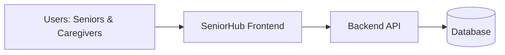
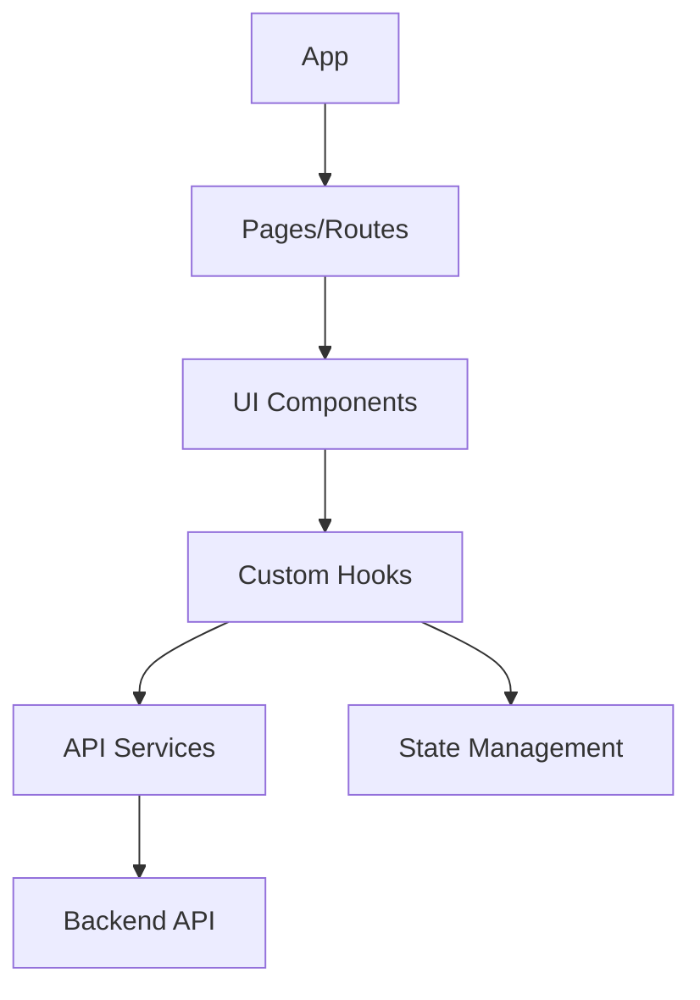

# ARCHITECTURE.md

## 1. Technical vision

`seniorhub-frontend` is a modern web application designed to provide an accessible, intuitive interface for seniors and their caregivers to manage household information and daily care tasks.

Current stack:

- React + TypeScript
- Vite (build tool and dev server)
- React Router (navigation)
- TanStack Query (data fetching and caching)
- CSS Modules or Tailwind CSS (styling)

## 2. Architecture principles

- Strict layer separation (UI, domain logic, data access, infrastructure)
- Component reusability and composability
- Accessibility-first design (WCAG 2.1 AA minimum)
- Responsive design for tablets and desktops
- Progressive enhancement
- Security and data protection by design
- Testability from day one

## 3. System context (target)



## 4. Application decomposition (target)



## 5. Directory structure (planned)

```
src/
├── app/                    # App initialization and routing
│   ├── App.tsx
│   ├── Router.tsx
│   └── config/
│       └── env.ts         # Environment configuration
├── pages/                  # Route-level components
│   ├── HomePage/
│   ├── HouseholdPage/
│   └── AuthPage/
├── components/             # Reusable UI components
│   ├── common/            # Generic components (Button, Card, etc.)
│   ├── layout/            # Layout components (Header, Sidebar, etc.)
│   └── features/          # Feature-specific components
├── hooks/                 # Custom React hooks
│   ├── useAuth.ts
│   ├── useHousehold.ts
│   └── api/              # API query hooks
├── services/              # API service layer
│   ├── api.ts            # Base API client
│   ├── auth.service.ts
│   └── household.service.ts
├── types/                 # TypeScript types and interfaces
│   ├── api.types.ts
│   └── domain.types.ts
├── utils/                 # Utility functions
│   ├── validators.ts
│   └── formatters.ts
└── styles/               # Global styles and theme
    ├── global.css
    └── theme.ts
```

## 6. Functional modules (v1 target)

### Core modules
- `auth`: Authentication and session management
- `household`: Household management (members, roles, invitations)
- `profile`: User profile and settings

### Daily Care (future)
- `medications`: Medication reminders and schedules
- `appointments`: Doctor visits, therapy sessions
- `tasks`: Daily activities and tasks

### Settings
- `accessibility`: Font size, contrast, keyboard navigation settings
- `notifications`: Notification preferences
- `privacy`: Privacy and data management settings

## 7. Main flows

### 7.1 Authentication flow

1. User lands on the application
2. If not authenticated, redirect to login page
3. User signs in with credentials (Google OAuth integration planned)
4. On successful authentication, store token securely
5. Redirect to household selection or home page
6. Token refresh handled automatically

### 7.2 Household management flow

1. User accesses household management from navigation
2. View current household members with roles
3. Invite new members via email
4. Accept/cancel invitations
5. Manage household settings
6. Switch between households if member of multiple

### 7.3 Navigation flow

1. Main navigation menu shows available sections
2. Each section has clear visual hierarchy
3. Breadcrumbs show current location
4. Back navigation always available
5. Accessible keyboard navigation throughout

## 8. API integration

### Authentication

- Token-based authentication (JWT expected)
- Headers: `x-user-id`, `x-user-email`, `x-user-first-name`, `x-user-last-name`
- Token stored in secure httpOnly cookie or localStorage (to be decided)
- Automatic token refresh before expiration

### API client

- Centralized Axios/Fetch client with interceptors
- Automatic error handling and retry logic
- Request/response logging (sanitized)
- Type-safe API contracts using TypeScript

### Key endpoints (from backend API)

- `GET /health` - Health check
- `POST /v1/households` - Create household
- `GET /v1/households/:id/overview` - Get household details
- `GET /v1/households/my-households` - List user's households
- `POST /v1/households/:id/invitations/bulk` - Send invitations
- `GET /v1/households/invitations/my-pending` - List pending invitations
- `POST /v1/households/invitations/accept` - Accept invitation

## 9. State management

### Local component state
- Use React `useState` and `useReducer` for component-level state
- Props drilling avoided through composition

### Server state
- TanStack Query (React Query) for server state caching
- Automatic background refetching
- Optimistic updates for better UX
- Cache invalidation strategies

### Global application state
- Context API for authentication state
- Context API for theme/accessibility preferences
- Minimal global state (avoid over-engineering)

## 10. Styling strategy

### Approach
- CSS Modules or Tailwind CSS (to be decided during setup)
- Mobile-first responsive design
- Design tokens for consistency (colors, spacing, typography)
- Accessibility-focused utilities

### Accessibility
- WCAG 2.1 AA compliance minimum
- High contrast mode support
- Keyboard navigation support
- Screen reader optimization
- Focus indicators visible and clear

## 11. Testing strategy

### Unit tests
- Vitest for unit and integration tests
- React Testing Library for component testing
- Test critical business logic and user interactions

### E2E tests (future)
- Playwright or Cypress for end-to-end tests
- Cover critical user journeys
- Run in CI/CD pipeline

## 12. Build and deployment

### Development
- Vite dev server with HMR
- Environment variables via `.env` files
- Local backend API proxy configuration

### Production
- Optimized production build via `vite build`
- Static asset hosting (Vercel, Netlify, or similar)
- CDN for global performance
- Environment-specific configuration

## 13. Security considerations

- No sensitive data in localStorage (use secure cookies or encrypted storage)
- CSRF protection for state-changing operations
- XSS prevention through React's built-in escaping
- Content Security Policy headers
- Regular dependency security audits
- Sanitize all user inputs before display

## 14. Performance targets

- First Contentful Paint < 1.5s
- Time to Interactive < 3s
- Lighthouse score > 90
- Bundle size optimization (code splitting)
- Image optimization and lazy loading

## 15. Pending decisions

- Final styling solution (CSS Modules vs Tailwind CSS)
- State management library if Context + React Query proves insufficient
- Authentication token storage strategy (cookie vs localStorage)
- PWA implementation timeline
- Internationalization library and strategy
